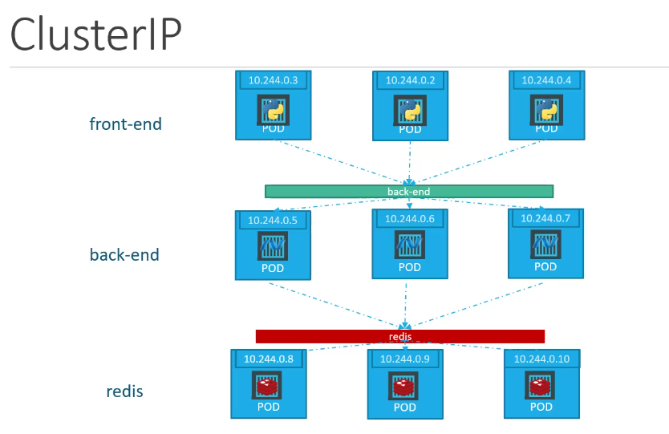

# Simple Kubernetes

Just a simple vagrant kubernetes 3 host vm system. The vagrantfile configures three vms with each 2 GB of RAM and 2 CPU cores, installs and configures docker and kubeadm.

An additional user "marc" with password "marc" is also created for ssh access.

## Usage

Well just do a ```vagrant up``` and you should be good to go. It requires that you have virtualbox and vagrant installed first.

## Kubernetes setup

Is completely manual, but this is desired.
The current join command is:

```kubeadm join 192.168.50.10:6443 --token 37gepx.0kiyqq9kyfzel7t5 --discovery-token-ca-cert-hash sha256:721925a1ed5d0fb87be07b0e5d2bd0391c7809179b964bf4272000654fc2aba1```

You have to configure client cert auth to be able to use kubectl.
To start using your cluster, you need to run the following as a regular user:

  mkdir -p $HOME/.kube
  sudo cp -i /etc/kubernetes/admin.conf $HOME/.kube/config
  sudo chown $(id -u):$(id -g) $HOME/.kube/config

You should now deploy a pod network to the cluster.
Run "kubectl apply -f [podnetwork].yaml" with one of the options listed [here](https://kubernetes.io/docs/concepts/cluster-administration/addons/)

Next step is to obviously install a cluster network.

```kubectl apply -f https://docs.projectcalico.org/v3.3/getting-started/kubernetes/installation/hosted/rbac-kdd.yaml```

```kubectl apply -f https://docs.projectcalico.org/v3.3/getting-started/kubernetes/installation/hosted/kubernetes-datastore/calico-networking/1.7/calico.yaml```

[source](https://kubernetes.io/docs/setup/independent/create-cluster-kubeadm/#instructions)

### Basic kubernetes stuff

Get all pods (from all namespaces): ```kubectl get pods --all-namespaces```

### Create Replicatsets

A replicaset is a process that monitors pods and ensures that there are always the desired amount of pod instances running.

```kubectl create -f pod-definition.yml``` allows you to deploy new pods based on the supplied yaml file.

- ```kubectl get replicaset``` list all replicasets
- ```kubectl describe replicaset [replicaset_name]``` displays information about the specified replicaset.
- ```kubectl delete replicaset [replicaset_name]``` deletes the replicaset including all pods that have matching labels as the selector.
- ```kubectl replace -f pod-definition.yml``` replaces a already existing replicaset with an updated config. This is useful if the number of replicas changes for example.
- ```kubectl scale --replicase=3 pod-definition.yml``` scales the number of running replicas for the replicaset. Remember, this is only temporary and doesn't change the yaml file!

### Deployments

Now this is where the real fun begins. Deployments are a further abstraction to kubernetes concepts like pods and replicasets. They encompass not only pods, but also replicasets, updgrade strategies and things like service and ingress definitions.

A sample yaml file is included as always and here are the most important kubectl commands for deployments.

- ```kubectl create -f deployment-definition.yml --record``` creates a deployment based off of a yaml file. If the record flag is added, there will be a new revision recorded as a rollout version.
- ```kubectl get deployments``` no explanation needed
- ```apply -f deployment-definition.yml``` updates a deployment based on the changes made in the yaml file (new version of image for example or number of replicas).
- ```kubectl set image deployment/[deployment-name] nginx=nginx:1.9.1``` updates the version of a image and the running pods in the deployment. This is dangerous obviously, because it is not saved in a yaml file.
- ```kubectl rollout status deployment/[deployment-name]``` shows the status of the current deployment.
- ```kubectl rollout history deployment/[deployment-name]``` shows the history of deployments for a specific deployment definition
- ```kubectl rollout undo deployment/[deployment-name]``` undos a rollout or update to a deployment (for example updating the image). This is actually achieved by creating a new replicaset for the upgraded version and if things faile, this command just removes the pods of that new replicaset and instantiates new containers from the old replicaset. Neat right?!

### Services

A service allows for a application, running inside pod(s), to be reachabel from either inside or outside the cluster. There are three primary ways to achieve this (well four to be exact).

- NodePort - Exposes a service running inside pod(s) on a specific port on the node (30080 for example). This NodePort is reserved on **ALL** nodes inside the cluster and default port range is 30000 to 32767.
- ClusterIP - Reserves a specific cluster IP for the service running inside pod(s). The service is then usually only reachable inside the cluster.
- LoadBalancer - This construct enables the kubernetes cluster to expose a service through an external load balancer. **IMPORTANT** This only truly works in a cloud environment where a external load balancer is connected to the kubernetes / etcd cluster to read the configMaps.

#### Defining a service

Defining a service is quite easy and you can look at a example at the [service yaml file](demo-yaml-files/service/service-definition.yml) for a simple example. Services use selectors like "name", "type" or "label" to choose which pod(s) this service exposes.

#### Reasonable architecture

Now that we have a basic understanding of how deployments and services work, we can look at a simple architecture that enables each component of a microservice architecture to communicate with its necessary peers. The graphic below shows a simple microservice app, split into three tier (frontend, backend and redis). *Source: KodeKloud*



For this architecture, we would define three services:

- frontend service of either type ```LoadBalancer```(if this is running in a cloud environment) or ```NodePort``` to expose them to the big wide world.
- backend service of type ```ClusterIP```. This service is only available inside the cluster and spans all nodes and pods with ```type: backend```.
- redis service of type ```ClusterIP```. This service again is only available inside the cluster and spans all nodes and pods with ```type: redis```.

There is a example [service yaml file](demo-yaml-files/service/simple-microserviceapp.yml)

## Kubernetes example voting app

The folder ```example-voting-app``` contains a complete set of deployments for the docker example app.

This folder contains deployment definitions for the Docker example app to showcase kubernetes.
it is meant to be deployed on a self hosted kubernetes cluster and does not depend on any external service.

There is however a caveat, where you have to provide your own external load balancer, if you want to truly test this app.
Below is the architecture and all the deployments created.


You can initialize the app with ```kubectl create -f ./example-voting-app/```.

**IMPORTANT** Obviously this is all ephermal and nothing survives a ```kuebctl delete -f [.yml files]```.

## LICENSE

GNU General Public License v3.0
See [COPYING](COPYING) to see the full text.
